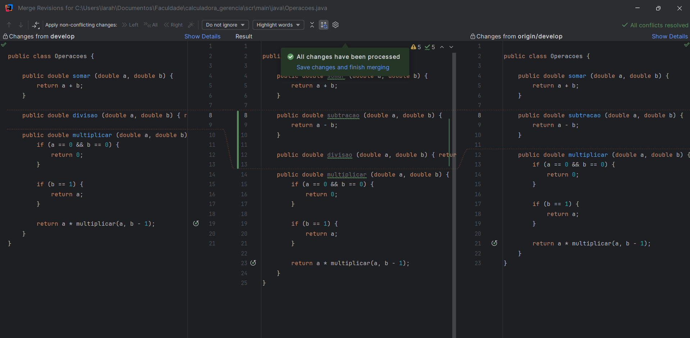
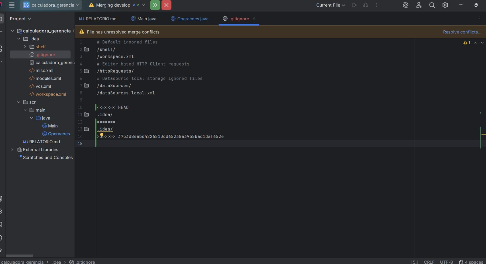

# RELATÓRIO DE PROJETO – Gerência de Configuração

# RELATÓRIO DE PROJETO – Estratégias de Branching em Git

## Identificação
- **Integrantes da equipe**:
- Ana Júlia 
- Larah Nanes da Costa
- Enriko Martins

- **Repositório GitHub**: https://github.com/laahnanes/calculadora_gerencia.git

## 1. Estrutura Inicial
- O repositório **calculadora_gerencia** foi criado no GitHub para simular o fluxo de trabalho de um time de desenvolvimento utilizando o **Git Flow**.


- Inicialmente, foi configurada a branch principal `main` e, a partir dela, a branch `develop`.


- O projeto é uma calculadora simples em Java, composta pelos arquivos:

  1. Main.java – responsável pela execução principal;
  2. Operacoes.java – contém as funções matemáticas (soma, subtração, multiplicação e divisão).


- Após a criação das branches, cada integrante fez o clone do repositório e sincronizou as branches locais com o remoto.

## 2. Fase 1 – Git Flow
### 2.1 Features
 - Durante esta fase, cada integrante foi responsável por implementar duas funcionalidades da calculadora, simulando o fluxo de trabalho de um time real.


- **Ana Júlia**
  - Criou os arquivos iniciais `Main.java` e `Operacoes.java`.
  - Implementou a função **somar**.
  - Posteriormente, adicionou a função **subtrair** na linha 8 do arquivo `Operacoes.java`.
  - Implementou o `Main.java` para chamar as funções com o uso do **Scanner**.

- **Larah**
  - Criou o repositório, criou as branchs **main** e **develop**.
  - Implementou a função **multiplicar** inicialmente.
  - Implementou a função **divisão**, gerando um conflito intencional na linha 8 do arquivo `Operacoes.java`.


- **Enriko**
  - Adicionou a **pasta Java** ao repositório.
  - Modificou a a função **multiplicar**.
  - Posteriormente, modificou a `Main.java` para chamar as funções com **valores fixos**.

### 2.2 Conflitos
####  Primeiro conflito – `Operacoes.java`

- Ocorreu quando **Ana Júlia** e **Larah** editaram a **mesma linha (linha 8)** do arquivo `Operacoes.java`.
  - Ana Júlia adicionou a função **subtração**.
  - Larah adicionou a função **divisão**.
- Ao tentar o `push`, o Git detectou conflito e impediu a integração automática.

**Procedimento de resolução:**
1. Foi feito um `git pull` para trazer as alterações mais recentes.
2. O conflito foi visualizado com os marcadores:




- As duas funções foram mantidas no arquivo final e foi feito o commit da resolução:


####  Segundo conflito – `Main.java`
- Ocorreu quando **Enriko** e **Ana Júlia** modificaram o mesmo trecho da Main.java.
  - Enriko implementou a chamada da **divisão com valores fixos**. 
  - Ana Júlia usou **Scanner para solicitar números** e **chamou a soma**.

- Ao tentar o `push`, o Git detectou conflito e impediu a integração automática.

**Procedimento de resolução:**
1. Foi feito um `git pull` para trazer as alterações mais recentes.
2. O conflito foi visualizado com os marcadores:

FALTA IMAGENS DO CONFLITO

####  Terceito conflito (Não intencional) – `.idea`

- Durante a configuração inicial do repositório, ocorreu um conflito relacionado à pasta .idea, gerada automaticamente pelo IntelliJ IDEA. Essa pasta contém arquivos de configuração locais da IDE, que variam entre os computadores dos integrantes. Por esse motivo, ao realizar commits e sincronizar o repositório, o Git identificava diferenças nesses arquivos, resultando em conflitos constantes. Para resolver o problema e evitar novos conflitos, o grupo optou por adicionar a pasta .idea ao arquivo .gitignore, garantindo que essas configurações locais não fossem mais rastreadas pelo controle de versão.



### 2.3 Release
- Criada branch `release/2.0`?
- Alterações preparatórias (ex.: versão, documentação).
- Integração com `main` e geração da tag `v2.0`.

### 2.4 Hotfix
- Após o lançamento da versão 2.0, foi identificado um erro na função de divisão, que não tratava a divisão por zero.
  Para corrigir o problema, foi criada a branch hotfix/2.0.1 a partir da main e posteriormente, uma tag.


- Depois disso, o hotfix foi integrado novamente em main e em develop:


### 2.5 Uso de Rebase
- Em qual feature aplicaram `git rebase`?
- Explique o que mudou no histórico.

## 3. Fase 2 – Trunk-Based Development
### 3.1 Branches Curtos
- Quais branches foram criados a partir de `main`?
- Quantos commits cada um teve?

### 3.2 Squash
- Qual merge foi feito usando **squash**?
- Explique por que foi escolhido squash em vez de merge normal.

### 3.3 Tag Final
- Tag criada: `v3.0`.

- Prints do histórico.

## 4. Histórico de Commits
Inclua saída do comando:

```bash
git log --oneline --graph --all